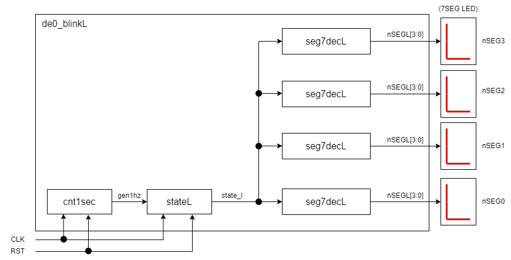

# de0_blinkL
## Abstract
The character L blinks on the 7-segment LED at Terasic DE0 (CycloneⅢ EP3C16F484C6).

## Block diagram
  

## Tools
・QuartusⅡ 13.0sp1  
・ModelSim-Altera 10.1d(QuartusⅡ 13.0sp1)  
The version of Quartus must be compatible with CycloneIII.  

## Movie  
https://youtu.be/AQZ__2tUfQU  